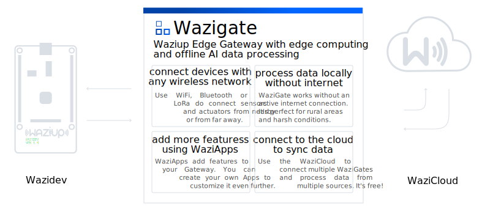

# Waziup Edge Gateway

This repo contains files and links for the Waziup Edge Gateway.

[](https://www.waziup.io/documentation/wazigate/) 
[](https://www.waziup.io/documentation/wazigate/v2/quick_start/) 
[](https://downloads.waziup.io/WaziGate_latest.zip)

Waziup Edge Gateway is a free software for Raspberry Pi that brings edge computing and basic AI data processing. It is designed to work without an active internet connection, which makes it perfectly to use in rural areas with limited to zero network connections. The Gateway supports wireless protocols like LoRa and Bluetooth to connect with various sensors and actuators.

Complete instructions for Windows, Linux and MacOS users can be found on the website: http://www.waziup.io/documentation.




## WaziGate Image (ISO)

To start with wazigate, head over to the WaziGate documentation at [waziup.io](https://www.waziup.io/documentation/wazigate/). There you will find the WaziGate Images the flash your Raspberry Pi. 

👉 WaziGate ISO images: https://www.waziup.io/downloads/

The best tool for flashing the ISO to an SD-Card is the [Raspberry Pi Imager](https://www.raspberrypi.com/software/). You can download the tool from [www.raspberrypi.com](https://www.raspberrypi.com/software/).

Inside Raspberry Pi Imager, click "Select own image" and select the WaziGate image that you just downloaded. When finished, insert the SD-Card into your Raspberry Pi and power it up. After a few minutes, the Pi wil be booted and you should be able to access the Dashboard on **[wazigate.local](http://wazigate.local)** when **connected to your router via LAN cable**. When there is no internet connection, the WaziGate will go into **Access Point Mode**. Look for a Wifi network called `WAZIGATE_...` and connect to that.

You can also use a keyboard and any HDMI screen with the Raspberry Pi to access the control panel directly. Using that panel you can also connect to a WiFi network quickly.

It may take some time for the device to boot for the first time!

If you are using Linux, connecting to the [wazigate.local](http://wazigate.local) address may not work for you. Check your router to fend the IP address of the Wazigate in you local network and connect to it using that address directly.

## Documentation

Have a look at the [waziup.io documentation](https://www.waziup.io/documentation/wazigate/) on WaziGate. There you will find easy step-by-step tutorials to setup your WaziGate and some YouTube tutorials that will help to get started very quick.

https://www.waziup.io/documentation/wazigate/

## Connecting via SSH

You can connect to the Raspberry Pi via SSH after you enabled the SSH server.

The Raspberry Pi documentation reads:

*For headless setup, SSH can be enabled by placing a file named ssh, without any extension, onto the boot partition of the SD Card. When the Raspberry Pi boots, it looks for the ssh file. If it is found, SSH is enabled and the file is deleted. The content of the file does not matter; it could contain text, or nothing at all.*

See https://www.raspberrypi.com/documentation/computers/remote-access.html#enabling-the-server.

The default SSH username is `pi` and the password `loragateway`. These are different from the username and password that you use in the WaziGate dashboard.

## Building the ISO

There is a repository at [github.com/Waziup/WaziGate-ISO-gen](https://github.com/Waziup/WaziGate-ISO-gen) that we use to create the image for Raspberry Pi (arm/v7 and arm/v8 architecture). It is based on the original [pi-gen](https://github.com/RPi-Distro/pi-gen) repository. The image is derived from the Raspberry Pi OS Lite, meaning that is does not come with a desktop environnement but has a very small footprint and the archive is less than 1GB in size.

## Building the debian package

To build the debian package, use:
```
dpkg-buildpackage -uc -us
```

## Running the WaziGate in a local debug environment

For development, the WaziGate can be run locally. For debugging, we recommend Visual Studio Code. There are some steps involved to make it possible to run locally. In the following these steps will be explained:
1. Clone the WaziGate repository and all sub-modules: 
```git clone --recursive https://github.com/Waziup/WaziGate```
2. Open Visual Studio Code and open the **wazigate-edge** folder as a project.
3. Navigate to [github.com/Waziup/wazigate-edge/blob/v2/.vscode/launch.json](github.com/Waziup/wazigate-edge/blob/v2/.vscode/launch.json) and change build-flags to: 
```"buildFlags": "-ldflags='-X main.branch=v2 -X main.version=2.0.0'" /* -X main.buildtime=1655894260 main.buildNr=1234*/```
4. Navigate to [github.com/Waziup/wazigate-edge/blob/v2/tools/host_linux.go](github.com/Waziup/wazigate-edge/blob/v2/tools/host_linux.go) and change the line from ```const sockAddr = "/var/run/wazigate-host.sock"``` to ```const sockAddr = "/tmp/wazigate-host.sock"```
5. Now press [F5] to run **wazigate-edge**.
6. Open **wazigate-dashboard** in Visual Studio Code.
7. Issue the command ```npm i``` and afterwards ```npm run watch-dev``` and press [F5] afterwards.
8. A browser will open now. The dashboard will be available at [http://localhost:8080/dev.html](http://localhost:8080/dev.html)
9. You can now put breakpoints for wazigate-edge (backend) in Visual Studio Code and for wazigate-dashboard (frontend) you can put your breakpoints in the browsers development enviroment.
10. Happy coding!


