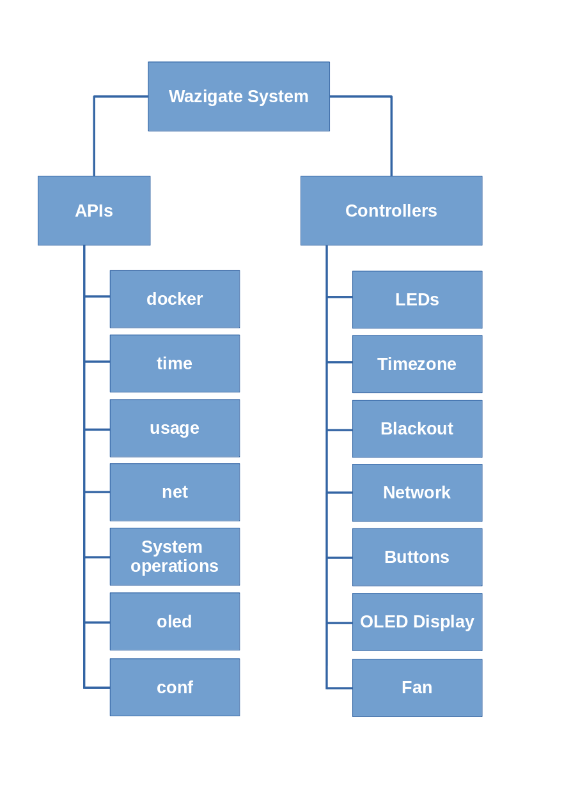

# Wazigate-System

The list of APIs can be found here: https://waziup.github.io/wazigate-system/

Source code documentation: https://pkg.go.dev/github.com/Waziup/wazigate-system

## System Architecture

Wazigate system composed of two main modules: _APIs_ and _Controllers_.

### APIs

`/api/routers.go` defines the API routes and the functions to be called for each of them.
For a better organization we group the related functions in relevant files which are listed below:

#### docker

This component takes care of all _docker_ related APIs. Listed below:

- `/docker`
- `/docker/:cId`
- `/docker/:cId/:action`
- `/docker/:cId/:action`
- `/docker/:cId/logs`
- `/docker/:cId/logs/:tail`

To serve these APIs we are required to communicate the docker service running on the host.
Therefore, we have to either call docker APIs on its socket mapped to a file on the guest (wazigate-system) container or run docker shell commands on the host directly. In the current version of the code we call `execOnHost(cmd)` function which executes a given command on the host and returns the result.

all the code is stored in `/api/docker.go` file.

#### time

This component takes care of all _time_ and _timezone_ related APIs. Listed below:

- `/time`
- `/timezones`
- `/timezone/auto`
- `/timezone`
- `/timezone`
- `/timezone`

The code is stored in `/api/time.go`.

#### usage

`/usage` API is part of `/api/health.go` and provides the CPU, RAM and Storage (e.g. Disk) usage.

#### net

This component serves all network related APIs, they listed below and all stored in `/api/network.go`:

- `/net`
- `/net/wifi`
- `/internet`
- `/net/wifi/scanning`
- `/net/wifi/ap`
- `/net/wifi/mode/ap`

To serve these APIs we use shell commands and tools such as `ip` and `iw`.
In order to switch to Access point mode, we run a shell script, stored in `/home/pi/waziup-gateway/wazigate-host/start_hotspot.sh`, on the host.

In order to connect to a WiFi router, first we store WiFi credentials on the host in this file: `/etc/wpa_supplicant/wpa_supplicant.conf` then we execute a shell script on host stored in `/home/pi/waziup-gateway/wazigate-host/start_wifi.sh`.

#### System Operations

System operations are stored in `/api/system.go` they cover the following APIs and some other functions:

- `/blackout`
- `/conf`
- `/shutdown`
- `/reboot`

_Note_: the `/blackout` API handler is stored in `/api/blackout.go`

#### oled

`/oled` API is to write a message on the OLED display and it is stored in `/api/oled.go` file.

#### conf

Read and Write into the configuration can be done through calling `/conf` API which is stored in `/api/system.go`.

### Controllers

A Controller refers to a piece of code usually running within a GoRoutine and takes care of a specific task. The controllers that we currently have in `wazigate-system` are listed below:

- `LEDs`
- `Timezone`
- `Blackout`
- `Network`
- `Buttons`
- `OLED Display`
- `Fan`

#### LEDs

This controller is initiated by calling `LEDsLoop()` function and constantly checks the status of the Gateway and updates the LEDs accordingly on the new WaziHat that we just produced. The full behavior of the LED indicators are explained at the end of this document. The code is stored in `/api/leds.go`.

#### Timezone

Timezone is not actually a controller, but we juts run it in a separate GoRoutine because it has to wait for the `wazigate-host` service to come up then it can run the timezone commands on it. It is initiated via calling `TimezoneInit()`.
The code is stored in `/api/time.go`.

#### Blackout

This controller is initiated via calling `BlackoutLoop()` and it constantly checks if a blackout has occurred and if so, it initiates a quick shutdown. Obviously, if the WaziHat does not have a blackout protection circuit, this controller exists.

The code is stored in `/api/blackout.go`.

#### Network

Network controller is initiated via calling `NetworkLoop()`. Its main objective is to keep the WiFi connection stable. It checks the WiFi connectivity periodically and takes proper action if the state changes.
In order to avoid conflict with `/net/*` API set, we use a `Mutex Lock` on the operation.
The code is stored in `/api/network.go`.

#### Buttons

On WaziHATs we have two buttons for power and WiFi control. The controller for these buttons is initiated by calling `ButtonsLoop()`. It runs two GoRoutines, one per button, and trigger proper action once the user pushes the buttons.
The code is stored in `/api/buttons.go`.

#### OLED Display

OLED Display controller is initiated by calling `OledLoop()`. It checks the status of the gateway and shows it on the display. It collects docker container status, `wazigate-host` daemon availability, internet connectivity, WiFi and Ethernet status and shows messages on `reboot` and `shutdown`. It also receives custom messages from the API.
The code is stored in `/api/oled.go`.

#### Fan

Fan controller is designed to keep the gateway cooled down in case its temperature goes beyond a specific threshold. It is initiated by calling `FanLoop()`. Obviously, user can determines the threshold in the dashboard and it is saved in the config file.
It uses `vcgencmd` tool to get the temperature of the CPU.
The code is stored in `/api/fan.go`.

---

## Status LED Indicator

The recent version of WaziGate has two status LEDs on board and `wazigate-system` indicates the connectivity status via those LEDs.

## LED 1

`LED 1` indicates the status of Internet connectivity and has two states:

- **Internet connectivity is ok**: it stays on: `_______________________________`
- **No Internet**: it blinks fast like this: `.............`

## LED 2

`LED 2` indicates the WiFi status and it has 3 states:

- **Access Point Mode**: this LED blinks slowly once a second: `__ __ __ __ __`
- **WiFi Client Mode Connected to a router**: it stays on: `_______________________________`
- **Trying to Connect**: it blinks fast like this with large off: `. . . . . . . . . . . . .`
- **Not Connected**: it blinks fast like this: `.............`
